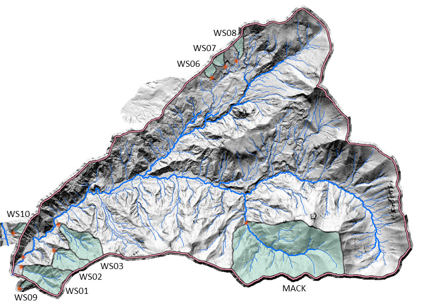

```{r setup, include=FALSE}
knitr::opts_chunk$set(echo = FALSE, message = FALSE, warning = FALSE, cache = FALSE)
```

```{r}
# Attach Packages

# In order to install extrafont, use following code in the console:
## install.packages("extrafont")

# In order to install NPS colors, use following code in the console:
## install.packages("devtools")
## devtools::install_github("katiejolly/nationalparkcolors")

# Attach packages
library(tidyverse)
library(tidyr)
library(here)
library(janitor)
library(ggridges)
library(plotly)
library(extrafont)
library(nationalparkcolors)
library(kableExtra)
library(effsize)
library(car)
library(ggbeeswarm)
```

```{r}
# Read in data and create new tidy dataframe

salamander_raw <- read_csv(here("raw_data", "mack_creek_vertebrates.csv")) 

salamander_clean <- salamander_raw %>% 
  clean_names() %>%
  filter(species == "DITE") %>% 
  select(section, weight, year, unittype)
  
```

\

### Introduction
TBD


<center>
{ width=75% }

<font size="2"> **Figure 1:** Pacific Giant Salamander (Dicamptodon tenebrosus), in Opal Creek Wilderness, Oregon. Photographer: [Dave Huth</font>](https://www.flickr.com/photos/davemedia/9094499321).
</center>

\

### Data & methods
<center>
{ width=75% }

<font size="2"> **Figure 2:** Map of HJ Andrews Forest Experimental Watersheds - Mack Creek watershed highlighted in green. Source: [HJ Andrews Experimental Forest</font>](https://andrewsforest.oregonstate.edu/research/infrastructure/watersheds).
</center>

\

Data for populations of Pacific Giant Salamanders *(Dicamptodon tenebrosus)* were collected in the [H.J. Andrews Experimental Forest](https://andrewsforest.oregonstate.edu/) near Blue River, Oregon as part of the National Science Foundation's Long Term Ecological Research Network. Salamanders were sampled with two-pass electrofishing in two sections of Mack Creek, one reach in a section of clearcut forest (ca. 1963) and the other an upstream 500-year-old coniferous forest. The two sections are then subdivided to indicate where in the channel salamanders were found (pool, cascade, or side-channel). According to project metadata, the purpose of the Aquatic Vertebrate Population Study in Mack Creek, is "to provide a long-term record of populations in aquatic vertebrates...related to land use and disturbance histories."

For more information see the project [metadata](https://portal.lternet.edu/nis/metadataviewer?packageid=knb-lter-and.4027.12)

All analyses and figures were prepared using R software version 3.6.1.

\

### Results

#### 1. Salamander counts in various sections of Mack Creek
<center>
```{r}

# Summarize count of salamanders by seciton and year
salamander_count_sec <- salamander_clean %>% 
  group_by(section, year) %>% 
  summarize(count = n()) %>%
  mutate(section_name = 
           ifelse(section == "CC", "Clear Cut",
         ifelse(section == "OG", "Old Growth", "")))

# Create plot of salamander count over years at each section
graph_1 <- ggplot(data = salamander_count_sec) +
  geom_line(aes(x = year, y = count, color = section_name))+
  theme_light()+
  labs(x = "",
       y = "Count",
       color = "Section")+
  scale_y_continuous(breaks = c(50, 75, 100, 125, 150, 175, 200, 225, 250, 275, 300, 325, 350, 375, 400))
  

graph_1
```
</center>

#### 2. 2017 Salamander counts by channel classification
<font size="2"> ***Table 1:***
*2017 counts of Salamanders found in Mack Creek, grouped by section (clear cut vs. old growth) and position within channel (pool, cascades, side-channel).* </font>

```{r}

# Summarize salamander counts by channel classification in 2017

salamander_summary_2017 <- salamander_clean %>% 
  filter(year == "2017", unittype != "IP") %>% 
  mutate(section_name = 
           ifelse(section == "CC", "Clear Cut",
         ifelse(section == "OG", "Old Growth", ""))) %>% 
  group_by(section_name, unittype) %>% 
  summarize(count = n()) %>%
  pivot_wider(names_from = unittype, values_from = count)
  
# Create contingency table

salamander_sum_2017_table <- salamander_summary_2017 %>% 
  janitor::adorn_percentages(denominator = "row") %>% 
  adorn_pct_formatting(digits = 0) %>% 
  adorn_ns(position = "front") %>% 
  rename(Section = section_name) %>% 
  rename(Channel = "C") %>% 
  rename(Pool = "P") %>% 
  rename("Side channel" = "SC")
  
# Make table pretty

kable(salamander_sum_2017_table) %>%
 kable_styling(bootstrap_options = c("striped", "hover"), 
              full_width = F,
              position = "center"
              )

  

```
\

#### 3. Chi-square test to assess association between forest section and channel classification in 2017

```{r, include = FALSE}

# Run chi sq test to explore whether channel position is independent of section type

chi_1_salamander <- salamander_summary_2017[-1]

chisq.test(chi_1_salamander)
```

We used a Chi-square test to examine the relationship between channel position (pool, side-channel or cascades) and section (clear cut or old growth) in Mack Creek 

