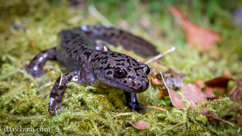

```{r setup, include=FALSE}
knitr::opts_chunk$set(echo = FALSE, message = FALSE, warning = FALSE, cache = FALSE)
```

```{r}
# Attach Packages

# In order to install extrafont, use following code in the console:
## install.packages("extrafont")

# In order to install NPS colors, use following code in the console:
## install.packages("devtools")
## devtools::install_github("katiejolly/nationalparkcolors")

# Attach packages
library(tidyverse)
library(tidyr)
library(here)
library(janitor)
library(ggridges)
library(plotly)
library(extrafont)
library(nationalparkcolors)
library(kableExtra)
library(effsize)
library(car)
library(ggbeeswarm)
```

```{r}
# Read in data and create new tidy dataframe

salamander_raw <- read_csv(here("raw_data", "mack_creek_vertebrates.csv")) 

salamander_clean <- salamander_raw %>% 
  clean_names() %>%
  filter(species == "DITE") %>% 
  select(section, weight, year, unittype)
  
```

\

### Introduction
TBD


<center>
{ width=75% }

<font size="2"> **Figure 1:** Pacific Giant Salamander (Dicamptodon tenebrosus), in Opal Creek Wilderness, Oregon. Photographer: [Dave Huth</font>](https://www.flickr.com/photos/davemedia/9094499321).
</center>

\

### Data & methods

\

### Results

#### 1. Salamander counts in various sections of Mack Creek

```{r}

# Summarize count of salamanders by seciton and year
salamander_count_sec <- salamander_clean %>% 
  group_by(section, year) %>% 
  summarize(count = n())

# Create plot of salamander count over years at each section
graph_1 <- ggplot(data = salamander_count_sec) +
  geom_line(aes(x = year, y = count, color = section))

graph_1
```

#### 2. 

```{r}

# Summarize salamander counts by channel classification in 2017

salamander_summary_2017 <- salamander_clean %>% 
  filter(year == "2017", unittype != "IP") %>% 
  group_by(section, unittype) %>% 
  summarize(count = n()) %>%
  pivot_wider(names_from = unittype, values_from = count) %>% 
  janitor::adorn_percentages(denominator = "col") %>% 
  adorn_pct_formatting(digits = 0) %>% 
  adorn_ns(position = "front") %>% 
  rename(Section = section)
  

salamander_summary_2017 %>% 
  kable(col.names = c("Cascades", 
                     "Pool",
                     "Side-channel"),
        row.names = c("Clear Cut",
                      "Old Growth")) %>% 
  kable_styling(bootstrap_options = c("striped", "hover"), 
                full_width = F,
                position = "center"
                )
```

